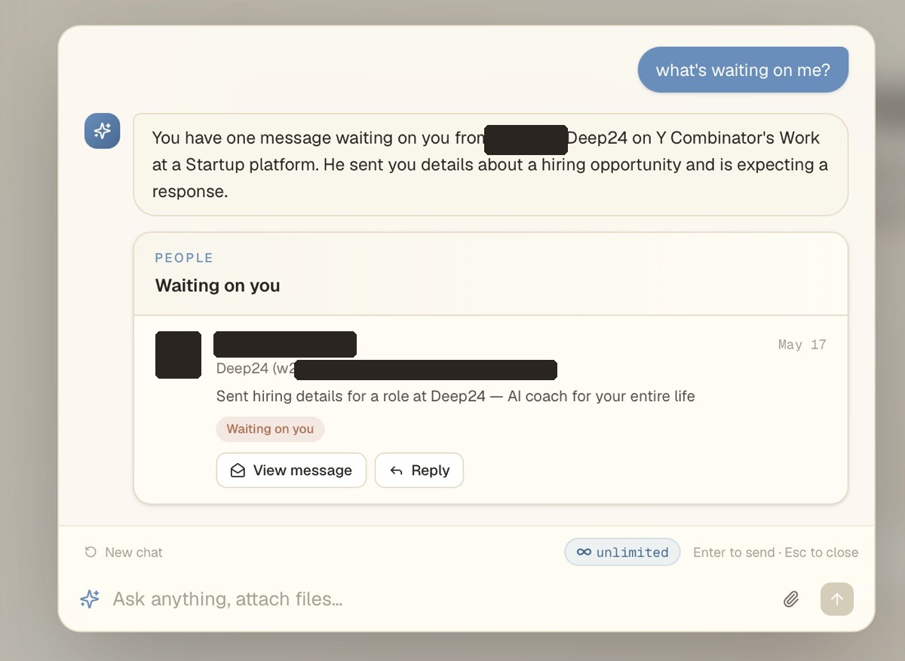
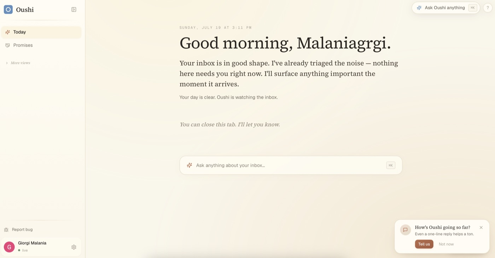
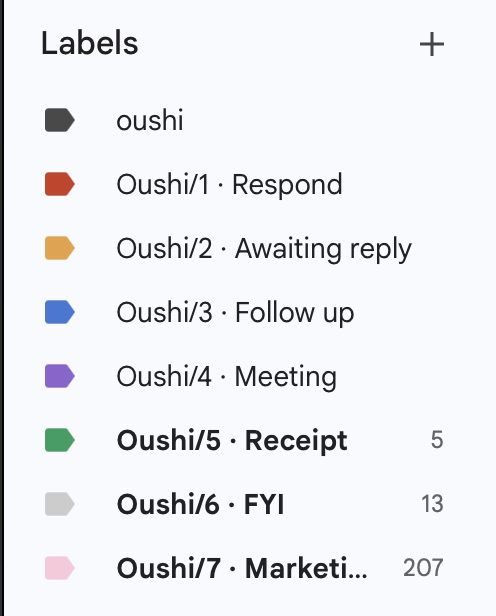

# oushi

A personal AI brain, an AI that actually knows you. Live at [oushi.app](https://oushi.app).

Oushi reads your Google life, starting with Gmail, and surfaces only the things that actually need you, so the "I forgot" moments get caught before you have them.

## A look inside

Ask Oushi anything about your inbox in plain English, and it answers from your own mail with the receipts attached:



The daily brief triages your inbox and tells you only what actually needs you:



Every email also gets a colored label in Gmail, so your inbox stays organized even outside Oushi:



## What it does

- Processes incoming mail in real time through Google Pub/Sub push notifications
- Parses sender and thread context to decide what deserves your attention
- Surfaces only the messages that require a response, in a daily-brief interface
- Built end to end: authentication, the real-time email pipeline, and the UI

## Stack

Next.js, TypeScript, Supabase, Google APIs (Gmail, Calendar, Pub/Sub), Anthropic SDK, Resend, Vercel

## Getting started

```bash
npm install
cp .env.example .env.local   # fill in your keys
npm run dev
```

Open [http://localhost:3000](http://localhost:3000).

## Environment

See `.env.example` for the required keys (Supabase, Google OAuth and Pub/Sub, Anthropic, Resend).
